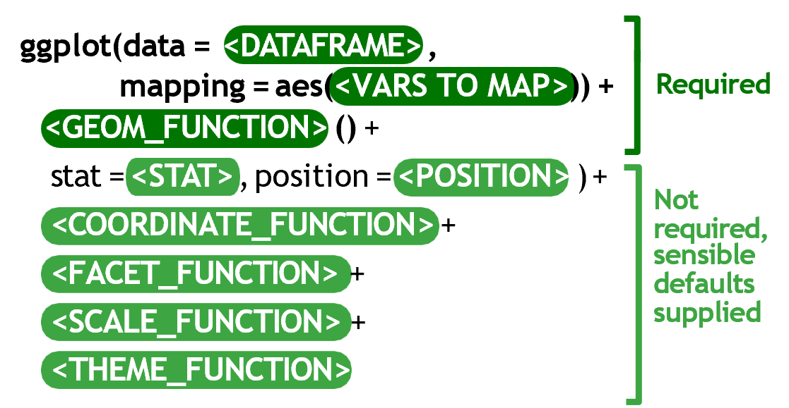

# Introduction to Bubble Plots

A **bubble plot** is a type of scatter plot where a third aesthetic is added: the **size** of points.

In 2006, a Swedish doctor named Hans Rosling gave a now-famous TED talk called ["The best stats you've ever seen"](https://www.ted.com/talks/hans_rosling_shows_the_best_stats_you_ve_ever_seen) where he presented global economic & health data using a bubble plot like this:


The x axis shows GDP, the log-transformed y axis shows life expectancy and the size of the bubbles represents population.

We will be recreating this plot in this workshop.

------------------------------------------------------------------------

# Packages

To get started, **load in the needed packages**: {tidyverse}, {here}, {plotly} and {gapminder}.

```{r}
# Load packages
"WRITE_YOUR_CODE_HERE"
```

------------------------------------------------------------------------

# Gapminder Data

The {gapminder} package contains global economic & health data from the Gapminder Foundation, which was started by Hans Rosling.

Run the following code to print the `gapminder` data frame from the {gapminder} package:

```{r message = FALSE}
# Tell R to get the inbuilt dataframe from the package
gapminder::gapminder
```

The columns include:

- `country`
- `continent`
- `year`
- `lifeExp`: Life expectancy at birth (average number of years a newborn child would live if current mortality patterns were to stay the same)
- `pop`: Total population
- `gdpPercap`: Gross domestic product per person (inflation-adjusted US dollars)

The `glimpse()` and `summary()` functions can tell us more about these variables.

```{r}
# Data structure
glimpse(gapminder)
summary(gapminder)
```

Data are recorded every 5 years from 1952 to 2007, but we will only be using the data from 2007 for this exercise.

We can use {dplyr} functions to manipulate the dataset and prepare it for plotting. 

Read through the code below and complete the data manipulation steps:

```{r}
# Create new data frame called gapminder07
gapminder07 <- gapminder %>%
  # FILTER data frame to only include rows from 2007
  "WRITE_YOUR_CODE_HERE" %>%
  # REMOVE the year column
  "WRITE_YOUR_CODE_HERE" %>%
  # RENAME columns to make them easier to understand
  rename(
    life_expectancy = lifeExp,
    population = pop,
    gdp_per_capita = gdpPercap
  ) %>%
  # REORDER dataset by DESCENDING population size (this will be useful for plotting later)
  "WRITE_YOUR_CODE_HERE"

# View new data subset
gapminder07
```

------------------------------------------------------------------------

# Simple Scatterplot with `geom_point()`

We will start with a regular scatter plot to show the relationship between life expectancy and GDP per capita.

Create a scatter plot, with GDP on the x axis and life expectancy on the y axis:

```{r}
# Simple scatterplot
"WRITE_YOUR_CODE_HERE"
```

Let's review this plot through the grammar of graphics:

1.  The `geom`etric objects - visual marks that represent the data - are points.
2.  The `data` variable **gdp_per_capita** gets mapped to the `x`-position `aes`thetic of the points.
3.  The `data` variable **life_expectancy** gets mapped to the `y`-position `aes`thetic of the points.

What we have created is a simple scatterplot by adding together the following components:

{width="482"}


# Convert to Bubble Plot with `size` Aesthetic

{width="482"}

Now, copy your code from the previous chunk and paste it below. Then make an updated version that includes an additional variable, `population`, mapped to the size aesthetic.

```{r}
# Create bubble plot
"WRITE_YOUR_CODE_HERE"
```

Now, let's color the bubbles by continent. Again, copy and paste your code from above, but now add the `color` aesthetic to the plot, mapping it to the `continent` variable.

```{r}
# Add color to points
"WRITE_YOUR_CODE_HERE"
```

**Side Note:** Remember when we arranged the population variable of `gapminder07` in descending order (largest to smallest). This was so that the smallest circles/bubbles are plotted on top of the larger circles/bubbles. If we had not arranged the `population` variable, smaller points would have been covered by the larger points.

However, many of the points are still overlapping, so we can decrease the opacity of the points. Copy and paste your code from above, then change the opacity of the points to 50%. The opacity is set using the `alpha` argument. Note that this is not within the `aes()` function, but directly within `geom_point()`, since we are setting it to a fixed value, not mapping it to a variable.

```{r}
"WRITE_YOUR_CODE_HERE"
```

Store the last plot as an object.

```{r}
# Save plot as a named object
gap_bubble <- "WRITE_YOUR_CODE_HERE"
```

Check that `gap_bubble` appears in your Environment pane.

------------------------------------------------------------------------

# Modifying Scales

One of the optional grammar of graphics layers that we haven't learned about yet is `scale_*()` functions.

Scales control how variables are mapped to the visual characteristics of the plot. Scale functions (which start with `scale_`) allow you to modify how mappings in `aes()` are displayed.



## Control point size with `scale_size()`

The first thing we need to improve on the previous bubble plot is the size range of the bubbles. 
`scale_size()` allows to set the size of the smallest and the biggest point using the `range` argument. We can modify the original plot object by adding new layers with `+`. Run the code below to set the size range of the points:

```{r}
gap_bubble02 <- gap_bubble +
  scale_size(range = c(1, 20))

gap_bubble02
```

Expanding the size range helps to highlight the variation in population size.

## Log transform scales

The original gapminder bubble plot we are recreating has a log-transformed scale on the x-axis. 
This helps by spreading out the points that are clumped on the left side of the plot.

In {ggplot2}, we can transform the x-axis using `scale_x_log10()`.
Below, add this function as a new layer after a `+` sign:

```{r}
gap_bubble03 <- gap_bubble02 +
  "WRITE_YOUR_CODE_HERE"

gap_bubble03
```

Scale functions will be covered in more detail in the next prework lesson.

## Remove scale guides

The scale guides for continent color and population size take up a lot of visual space.

We can remove these guides for a cleaner look. This takes away some information, but we will find a solution for this in the next step.

Run the code below to remove the scale guides:

```{r}
gap_bubble04 <- gap_bubble03 +
  guides(size = "none", color = "none")
gap_bubble04
```

## Adding interactivity with {plotly}

Our current bubble plot doesn't show us the exact population and GDP of the country.

One way to communicate this information without crowding the graph is to make it interactive. 

The `ggplotly()` function from the {plotly} package can convert your plot to be interactive! 

Wrap your bubble plot with `ggplotly()` to implement this:

```{r}
# Create interactive plot
"WRITE_YOUR_CODE_HERE"
```

We can't save this interactive plot with `ggsave()`. For this we will need the `saveWidget()` function from the {htmlwidgets} package.

Search the web for how to use this function, and save your interactive plot as a HTML file in the "images" folder.

```{r}
# Save plotly plot
"WRITE_YOUR_CODE_HERE"
```

## Bonus Challenge (Optional Ungraded)

Now try to create an animated bubble chart using the {gganimate} package! 

Familiarize yourself with the {gganimate} package available here: <https://gganimate.com/>. 

The front page of the website actually contains much of the code you will need for this Gapminder bubble plot.

```{r}
"WRITE_YOUR_CODE_HERE"
```

Here are the basic steps:

1.  Install and load the {gganimate} package.

2.  Create a basic bubble chart similar to the one we made in this tutorial, but using all the gapminder data, not just 2007. Map the `gdpPercap` variable to x, `lifeExp` to y, and `pop` to size.

3.  Add the animation by including `transition_time(year)` after the scatterplot layers. This will create the animation over time.

4.  Render the animation and save it as a video or GIF.